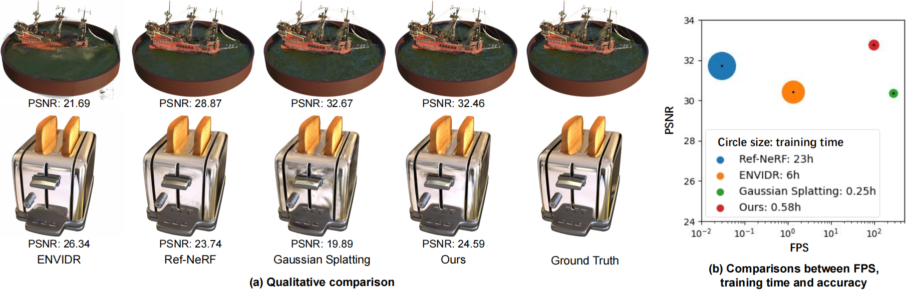
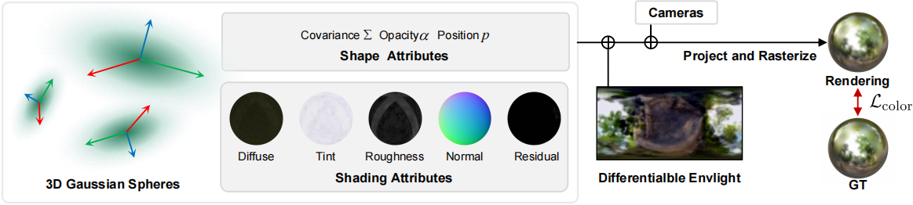

  <h1 align="center">GaussianShader: 3D Gaussian Splatting with Shading Functions for Reflective Surfaces</h1>
  

    <a href="https://github.com/Asparagus15">Yingwenqi Jiang</a>,
    <a href="https://github.com/donjiaking">Jiadong Tu</a>,
    <a href="https://liuyuan-pal.github.io/">Yuan Liu</a>,
    <a href="https://gaoxifeng.github.io/">Xifeng Gao</a>,
    <a href="https://www.xxlong.site/">Xiaoxiao Long</a>,
    <a href="https://www.cs.hku.hk/people/academic-staff/wenping">Wenping Wang</a>,
    <a href="https://yuexinma.me/aboutme.html">Yuexin Ma</a>

  

  <h3 align="center"><a href="None">Paper</a> | <a href="https://asparagus15.github.io/GaussianShader.github.io/">Project Page</a></h3>
  

  

  GaussianShader maintains real-time rendering speed and renders high-fidelity images for both general and reflective surfaces. 
  Ref-NeRF and ENVIDR attempt to handle reflective surfaces, but they suffer from quite time-consuming optimization and slow rendering speed.
  3D Gaussian splatting keeps high efficiency but cannot handle such reflective surfaces.

 

  

  GaussianShader initiates with the neural 3D Gaussian spheres that integrate both conventional attributes and the newly introduced
  shading attributes to accurately capture view-dependent appearances. We incorporate a differentiable environment lighting map to simulate
  realistic lighting. The end-to-end training leads to a model that reconstructs both reflective and diffuse surfaces, achieving high material
  and lighting fidelity.

 